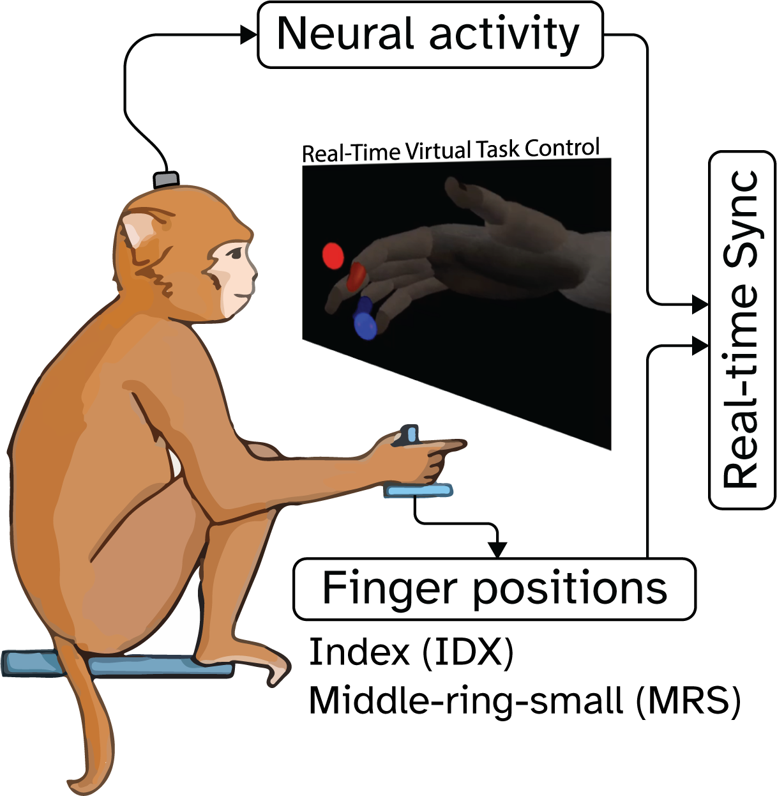

# Data Access & Structure

The LINK dataset contains long-term intracortical recordings from a nonhuman primate performing dexterous finger movements across four years.
It enables the study of neural stability, drift, and long-term BCI decoding.

## Experimental Setup

- **Subject:** Male rhesus macaque (*Macaca mulatta*), recorded between ages 7-11.
- **Implants:** Two 64-channel Utah microelectrode arrays (Blackrock Neurotech) placed in the hand area of the right precentral gyrus.
- **Recording duration:** 1,242 days post-implant, with 303 valid recording days after curation.
- **Signal types:**
   - **Threshold Crossings (TCR):** spike count features obtained using -4.5x RMS thresholding at 30 kHz sampling, then summed into 20 ms bins.
   - **Spiking-Band Power (SBP):** RMS power of bandpass-filtered (300-1,000 Hz) data, sampled at 2 kHz and averaged into 20 ms bins.
- **Behavioral task:** A two-degree-of-freedom finger flexion task with two target styles:
    1. *Center-out*: fixed sequence of target positions.
    2. *Random target*: randomized order and position each trial.
- **Kinematics:** Finger joint angles measured continuously and synchronized with neural recordings.
**Behavioral data were averaged into 20 ms bins**, and **velocity was calculated post hoc**.

---

## Data Curation 

For details on dataset curation, refer to the *Supplementary Materials* of the NeurIPS publication.

---

## Data Format and Organization
 
All files are hosted on the [DANDI Archive] (https://dandiarchive.org/dandiset/001201) and follow the **Neurodata Without Borders (NWB)** format. 

A demo notebook will be availabel soon to illustrate data loading and structure – [view demo notebook (coming soon)] 
